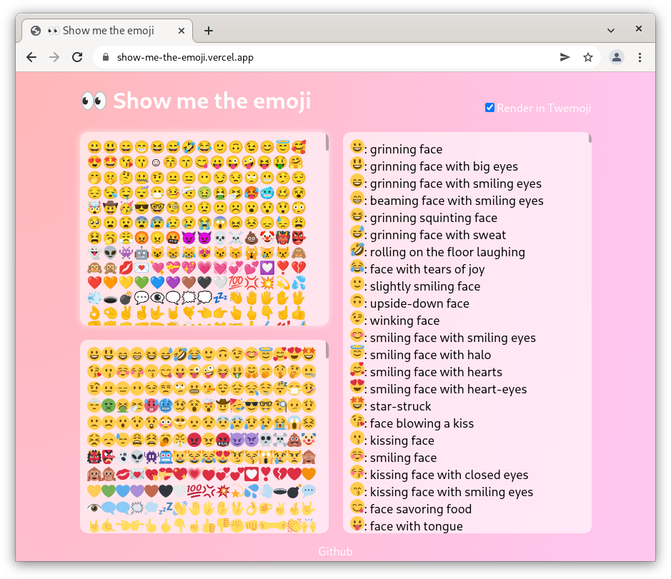

# :eyes: Show me the emoji

A simple web page for querying the meaning of emoji in text.

Demo: [https://show-me-the-emoji.vercel.app/](https://show-me-the-emoji.vercel.app/)

# :sparkles: Feature

- Show system unsupported emoji (render unsupported emoji using [Twemoji](https://github.com/twitter/twemoji)).
- Query the meaning of each emoji in the text.

# :framed_picture: Screenshot

